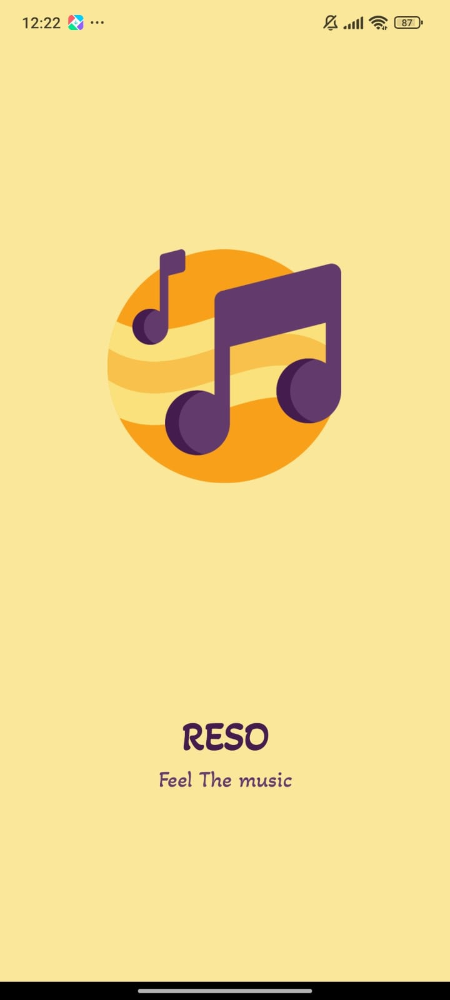
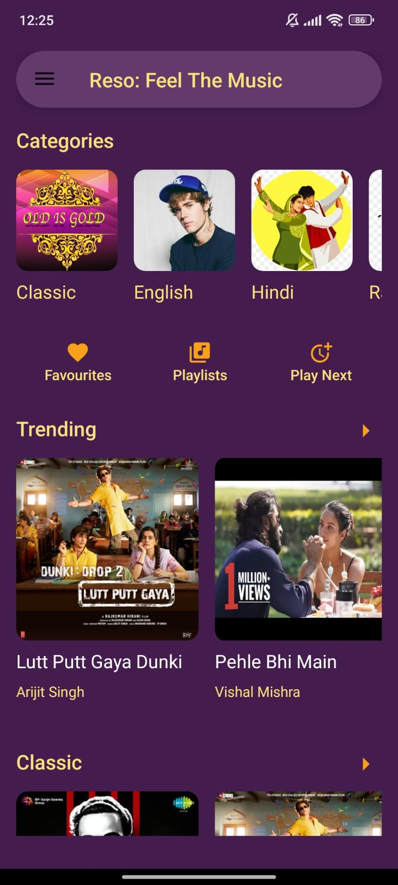
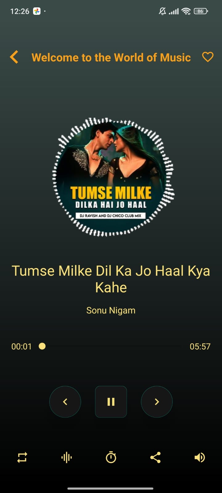
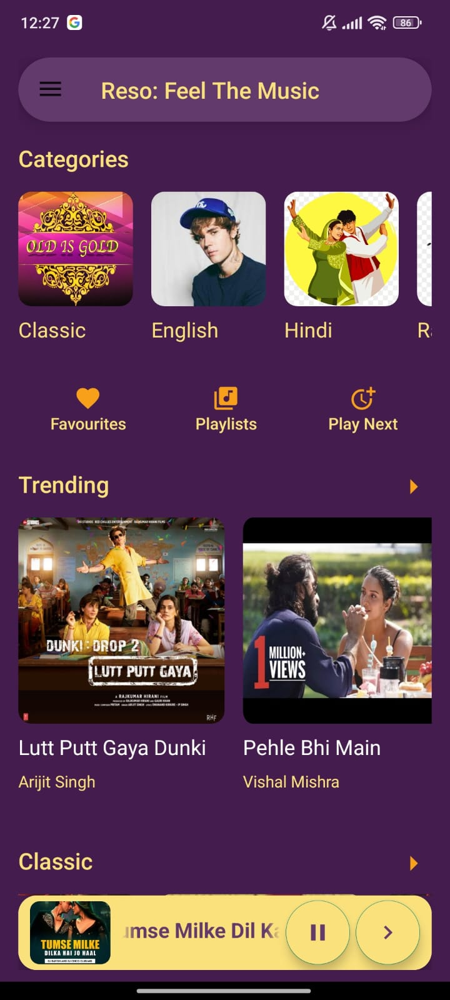
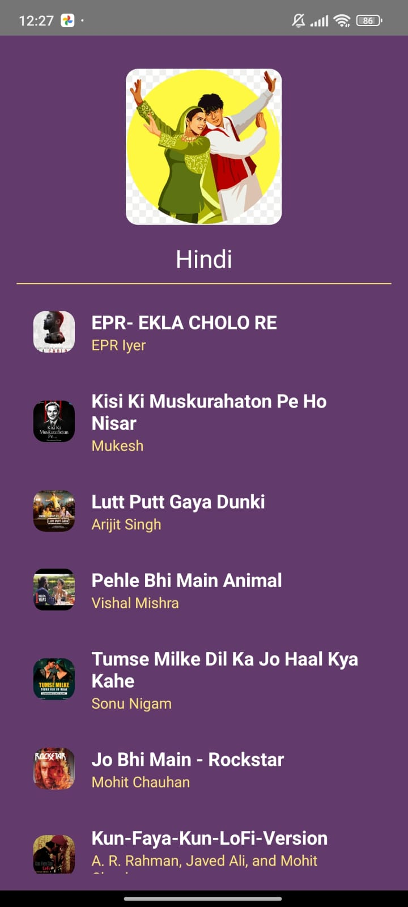
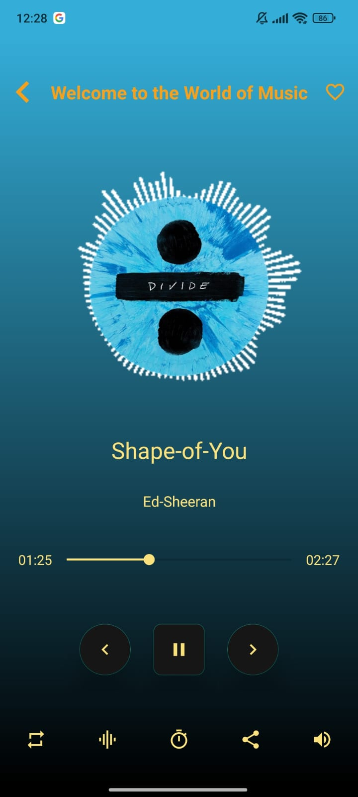

# Reso - Feel the Music 🎵

Reso is a delightful music streaming app that lets you immerse yourself in the world of music. With a user-friendly interface and seamless functionality, Reso aims to provide a captivating musical experience.

## Features

- 🎶 **Extensive Music Library:** Access a vast collection of songs stored on Firebase for an endless music selection.

- 📡 **Real-time Streaming:** Enjoy uninterrupted music streaming with seamless playback.

- 📱 **Notification Controls:** Control the music playback conveniently from the notification bar, even if the app is not in the foreground.

- 🚀 **Background Playback:** Music continues to play even if the app is cleared from the stack memory, ensuring a continuous listening experience.

- 🛑 **Exit Button:** Use the exit button in the notification to stop playback and exit the app entirely.

- 🔁 **Repeat Button:** Repeat your favorite songs seamlessly with the repeat button.

- 🎚️ **Equalizer Button:** Personalize your audio experience with the built-in equalizer.

- ⏰ **Timer Functionality:**
  - Set a timer for 15, 30, or 60 minutes, after which the app will automatically close.

- 📤 **Share Button:** Share your favorite songs or the app itself with friends and family.

## Language Used

Reso is implemented in the **Kotlin** programming language.

Open the project in Android Studio.

# Set up Firebase:

1)Create a Firebase project on the Firebase Console.
2)Add your Firebase configuration to the app.
3)Build and run the app on your device or emulator.

# Usage
1)Explore the vast music library and select your favorite songs.

2)Enjoy a seamless streaming experience.

3)Control playback using the notification controls, even when the app is in the background.

4)We have different Categories such as Classic , English , Hindi , Rap and Trending. In each category there are multiple songs. We also have differnt Sectons such as Trending , Classic , All Time Hit . In each sections there are many songs. 

4)Utilize additional features such as the repeat button, equalizer, timer, and share button.

5)Use the exit button in the notification to stop playback and exit the app.

# Screenshots

  
  

  
  

  
  

# Support
For any issues or inquiries, please open an issue.

Feel the music with Reso! 🎧

